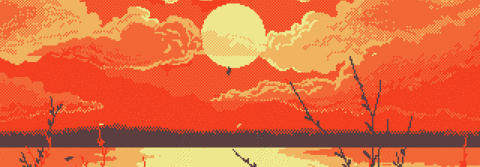

Art By @Anasabdin

# 👾 Valdemiro Gabriel

**`Desenvolvedor Backend`**

Olá, me chamo Valdemiro Gabriel, tenho 23 anos, sou estudante de Análise e Desenvolvimento de Sistemas no Instituto Federal do Piauí Campus de Pedro II. Gosto de Robótica, Sistemas Embarcados, Sistemas Web e as vezes desenvolver jogos engraçados. Atualmente faço residência em Sistemas Embarcados.

---

### 🤖 Linguagens e Tecnologias

 
 

### 📊 Estatísticas

  

<picture>
  <source media="(prefers-color-scheme: dark)" srcset="https://raw.githubusercontent.com/valdomg/valdomg/output/github-snake-dark.svg" />
  <source media="(prefers-color-scheme: light)" srcset="https://raw.githubusercontent.com/valdomg/valdomg/output/github-snake.svg" />
  
</picture>
